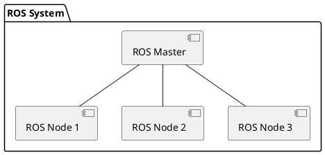

# ROS: Basic, Motion, and OpenCV

## 1. Introduction

1. What is this course about?
2. What if you face errors and need to debug and find solutions?

## 2. ROS Software Development

1. About this section (slides attached to resources)
2. Introduction
3. Why did I decide to use ROS in my work?
4. The Robot Life Cycle
5. ROS Impact
6. Self-Driving Car Use Case
7. ROS Evolution
8. ROS Distributions (version) over Time
9. ROS Architecture
10. ROS Basic Concepts and Demo
11. ROS Communication Paradigms (Topics/Services/ActionLib)
12. ROS Path Planning and Navigation
13. Limitation of ROS
14. ROS2

## 2. Setting your environment with ROS Noetic

1. Install ROS Slides
2. Install ROS Noetic on Ubuntu 20.04
3. Create your catkin workspace with ROS Noetic
4. Clone the right GitHub Repository for the ROS Noetic distribution
5. Testing your installation with C++ nodes
6. Testing and fixing installation with Python nodes
7. [UPDATE] Note: My recommendation for the editor to use
8. [IMPORTANT] BEFORE START WORKING ON THE COURSE

## 3. Create a ROS-Workspace and a ROS-Package

1. Section Note Update
2. ROS Workspace and ROS Package (Setting up your ROS projects)
3. Wrapping up

Practice Test 1: ROS Workspace and ROS Package

## 4. ROS Computation Graph

1. What is a ROS Computation Graph?
2. ROS Computation Graph Life Cycle
3. Start the ROS Master Node
4. How to run a new node (executable) in ROS?
5. What happens when we start a new ROS node?
6. Adding a teleop node to make the robot move
7. Get the information of a node and the information of a topic
8. The content of the motion message /tutle1/cmd_vel
9. Understand the structure of a ROS message
10. How to show the message structure on ROS command line?
11. Publish a message on a topic from a command line
12. Visualize the ROS Computation Graph using ros_rqt_graph
13. Demo: Starting Turtlesim and checking information about the nodes and topics
14. Demo: Showing the content of ROS messages published
15. Demo: Understand the pose topic
16. Demo: What is the benefit of using ROS?
17. Demo: Publishing a message from a command line using rostopic pub
18. Demo: rqt_graph

Quiz 1: [Quiz] ROS Computation Graph Start

Assignment 1: ROS Filesystem and Ecosystem

## 5. ROS Topics

1. ROS Topics Overview

2. Question: what happens if ROS Master crashes?

3. Guidelines to Write a Publisher and a Subscriber in ROS

4. Overview of the Talker/Listener Application (ROS Hello World Example)

5. Write a Publisher Node in Python

6. Write a Subscriber Node in Python

7. [DEMO] Talker/Listener in Python

8. Write a Publisher/Subscriber Node in C++

9. [DEMO] Talker/Listener in C++

10. Do-It-Yourself Assignment Explanation

Assignment 2: Do-It-Yourself: Write your First ROS Program to Control the Motion of a Robot Start

## 6. ROS Messages

1. Create Custom ROS Messages: Overview

2. [Demo] Create a Custom ROS Message: Implementation

3. [DEMO] IoTSensor Custom Message Publisher/Subscriber Applications

## 7. ROS Services

1. What is a ROS Service?

2. Understand ROS Services with Turtlesim

3. [DEMO] ROS Services with Turtlesim

Assignment 3: Do-It-Yourself: ROS Service Hands-On Practice

1. AddTwoInts Service Overview

2. Create the Service File and Request/Response Messages

3. Write ROS Service (Client/Server) in Python

4. [DEMO] Write ROS Service (Client/Server) in Python

5. [DEMO] Writing a ROS Service (Client/Service) in C++

Assignment 4: Rectangle Aera ROS Service (with video solution)

## 8. Motion in ROS

1. Note about this updated section

2. Cleaning Application Overview

3. Step 1. Understand Topics and Messages Used in the Application

4. Import the Libraries in Python and C++

5. The Divide and Conquer Approach

6. Move Straight Line (C++/Python)

7. [DEMO] Move Straight Line (C++/Python)

8. Rotate Motion (C++/Python)

9. [Demo] Rotate Motion (C++/Python)

10. Go-To-Goal Behavior

11. [Demo] Go-To-Goal Behavior

12. Set Desired Orientation

13. [Demo] Set Desired Orientation

14. Spiral Trajectory

15. Spiral Trajectory Demo

16. Putting All Together: The Cleaning Application

17. Running Multiple Nodes with a Launch File

## 9. ROS Tools and Utilities

1. ROS Network Configuration

2. Launch Files (Part I): Running multiple nodes with roslaunch

3. Launch Files (Part II): including a launch file and define parameters

## 10. Turtlebot 3

1. Install Turtlebot3 Simulator

2. Overview of Turtlebot3 Simulation Environment

3. [Demo] Simple Demo with Turtlebot3

## 11. Computer Vision in ROS with OpenCV

1. OpenCV Overview

2. [BEFORE ROS-NOETIC] Install OpenCV for ROS (Melodic/Kinetic)

3. [New] Install OpenCV for ROS Noetic

4. Additional Note about OpenCV installation

5. OpenCV: Open/Save Image Files (Python)

6. OpenCV: Pixels and Image Structure (Python)

7. OpenCV: Image Encoding (Python)

8. OpenCV: Video Streams Input (Python)

9. OpenCV: Drawing Shapes

10. CvBridge: Bridging OpenCV and ROS

11. Simple and Adaptive Thresholding in OpenCV

12. Color Filtering in OpenCV (Tennis Ball use case)

13. Contours Detection and Processing in OpenCV

14. Tennis Ball Detection using OpenCV

15. OpenCV (C++) Video Input/Output

16. OpenCV (C++) Open and Save Images

17. OpenCV (C++) CvBridge: Bridging Images between OpenCV and ROS

Assignment 5: Computer Vision Project: Ball Tracking with OpenCV and ROS

## 12. Laser Range Finders

1. What is a Laser Range Finder?

2. Laser Range Finders Characteristics

Quiz 2: Laser Range Finders Quiz

1. Commercial Laser Range Finder Devices

2. Laser Scanner Devices used in Demonstrations

3. Connect Asus Live Pro RGBD Camera as a Laser Scanner

4. Connect Hokuyo URG 4LX Laser Scanner with ROS

1. Save Laser Scan Messages into a Bag File and Replay Them

2. Write a ROS Node (Python) as a Subscriber to a Laser Scanner

3. Write a ROS Node (C++) as a Subscriber to a Laser Scanner

Assignment 6: Hands on-Activity on Laser Scanner

## 13. rosserial: Connecting a Hardware with ROS

1. What is rosserial?

2. What is Arduino?

3. Arduino Uno Board

4. Arduino IDE Overview

5. Install and Setup Arduino IDE

6. Range Sensor and Connection Setup

7. Programming The Ultrasonic Sensor with Arduino

8. Install rosserial libraries

9. rosserial Hello World application: Arduino ROS Publisher

10. rosserial Blink application: Arduino ROS Subscriber

11. rosserial using Arduino Ultrasonic Range Sensor
